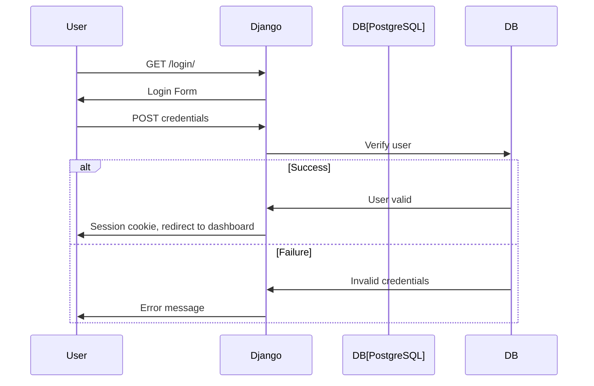
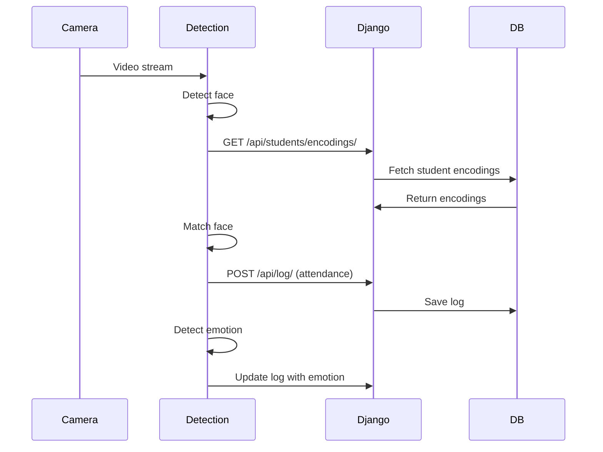
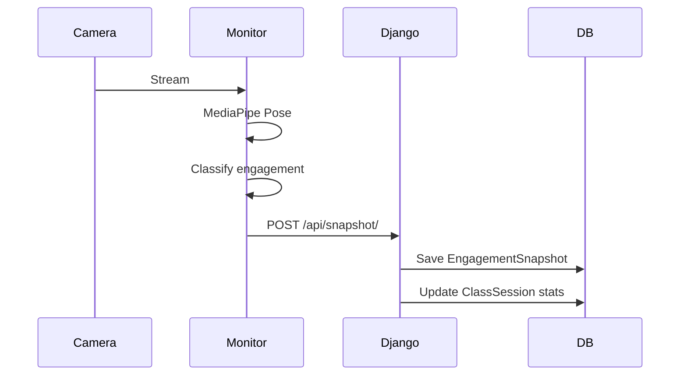

# System Architecture

## Overview

The Classroom IoT System is a Django‑based web application with integrated machine‑learning capabilities for attendance, behavior monitoring, and lab supervision. It uses a modular architecture with four main Django apps:

1. `entrance_cam`: Fingerprint enrollment and main entry management
2. `camera_attendance`: Camera‑based face recognition attendance
3. `classroom_monitor`: Real‑time classroom behavior and engagement monitoring
4. `lab_monitor`: Lab supervision with WebRTC screen sharing

## Architecture Diagram

```mermaid
graph TD
    User[End User] --> Nginx[Nginx Reverse Proxy]
    Nginx --> Django[Django Application]
    Django --> PostgreSQL[(PostgreSQL Database)]
    Django --> MLModels[ML Models]
    
    ESP32[ESP32 Device] --> Django
    Camera[IP Camera / Webcam] --> DetectionScript[Detection Scripts]
    DetectionScript --> Django
    
    StudentWeb[Student Browser] --> Django
    StudentWeb -- WebRTC --> Django
    
    Django -- WhatsApp Alert --> Twilio[Twilio API]
    
    subgraph "Infrastructure"
        Nginx
        Django
        PostgreSQL
        Supervisor[Supervisor<br>(Process Manager)]
        DetectionScript
    end
    
    subgraph "Machine Learning"
        MLModels
        FR[Face Recognition]
        Emotion[Emotion Detection]
        Pose[Pose Estimation]
        YOLO[YOLO Object Detection]
        Fight[Fight Detection]
    end
    
    MLModels --> FR
    MLModels --> Emotion
    MLModels --> Pose
    MLModels --> YOLO
    MLModels --> Fight
```

## Frontend Architecture

The frontend uses **Django Templates** with vanilla HTML/CSS/JavaScript. Key features:

- Responsive design for admin and student dashboards
- WebRTC integration for screen sharing (lab monitoring)
- Real‑time updates using AJAX polling
- Camera stream proxies for live views

### Static Files
- `static/`: CSS, JavaScript, images
- `templates/`: Django HTML templates

## Backend Architecture

### Django Apps

#### 1. `entrance_cam`
- Student registration and management
- Fingerprint enrollment via ESP32 devices
- Fingerprint attendance API endpoints
- WhatsApp integration for alerts

#### 2. `camera_attendance`
- Camera stream management
- Face recognition attendance
- Emotion detection at entry/exit
- Mood comparison tracking

#### 3. `classroom_monitor`
- Classroom session management
- Engagement monitoring (pose detection)
- Fight detection using 3D CNN
- Incident reporting and alerting

#### 4. `lab_monitor`
- Lab session management
- WebRTC signaling for screen sharing
- Screenshot capture and logging
- Camera snapshot analysis

### Background Processes

Supervisor manages multiple long‑running detection scripts:
- Face recognition attendance workers
- Classroom behavior monitors
- Fight detection services

## Authentication Flow



## Database Interactions

All database operations use Django ORM. Key models:

- `Student`: Student profile, face encodings, fingerprint ID
- `Camera` / `ClassroomCamera`: Camera configurations
- `Attendance Logs`: Fingerprint and camera attendance records
- `EngagementSnapshot`: Classroom engagement metrics
- `IncidentReport`: Behavior incidents

## External Service Integrations

### Twilio (WhatsApp)
- Used for sending critical incident alerts
- Requires TWILIO_ACCOUNT_SID, TWILIO_AUTH_TOKEN, and phone numbers
- Alerts sent for fights, phone usage, eating in class

### ESP32 Devices
- Communicate via REST API
- Handle fingerprint enrollment and attendance
- Maintain online/offline status

### IP Cameras
- Support MJPEG, RTSP, and snapshot streams
- Proxied through Django for secure access

## Data Flow Diagrams

### Attendance (Face Recognition)



### Classroom Engagement



## Design Decisions and Tradeoffs

| Decision | Rationale | Tradeoffs |
|----------|-----------|-----------|
| Django ORM over raw SQL | Rapid development, migrations, security | Slight performance overhead |
| PostgreSQL instead of SQLite | Scalability, concurrency, better for ML workloads | More complex setup |
| Supervisor for process management | Reliable long‑running detection scripts | Additional service to monitor |
| Vanilla JS over frontend framework | Simplicity, no build step | Less interactive UI |
| Face recognition + fingerprint redundancy | Multiple attendance options | Increased complexity |
