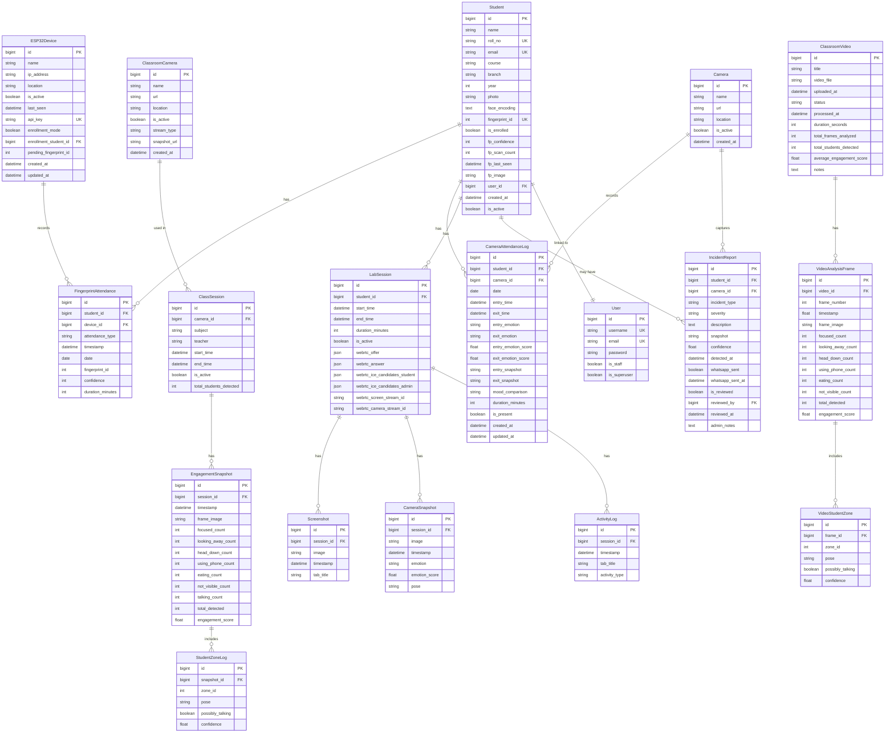

# Database Schema

## ER Diagram (Mermaid)

## Tables

### 1. `auth_user` (Django Default)
| Column | Type | Constraints | Description |
|--------|------|-------------|-------------|
| id | bigint | PK, Auto | User ID |
| password | string | | Hashed password |
| last_login | datetime | | Last login timestamp |
| is_superuser | boolean | | Superuser flag |
| username | string | UK | Username |
| first_name | string | | First name |
| last_name | string | | Last name |
| email | string | UK | Email address |
| is_staff | boolean | | Staff flag |
| is_active | boolean | | Active flag |
| date_joined | datetime | | Join date |

### 2. `entrance_cam_student`
| Column | Type | Constraints | Description |
|--------|------|-------------|-------------|
| id | bigint | PK, Auto | Student ID |
| name | string(100) | | Full name |
| roll_no | string(30) | UK | Roll number |
| email | string(254) | UK | Email address |
| course | string(20) | | Course (B.Tech, etc.) |
| branch | string(100) | | Branch/Department |
| year | int | | Year of study |
| photo | string | | Path to photo |
| face_encoding | text | Nullable | JSON list of 128‑float face encoding |
| fingerprint_id | int | UK, Nullable | Fingerprint sensor ID |
| is_enrolled | boolean | Default False | Enrollment status |
| fp_confidence | int | Nullable | Fingerprint confidence |
| fp_scan_count | int | Default 0 | Fingerprint scan count |
| fp_last_seen | datetime | Nullable | Last fingerprint scan time |
| fp_image | string | Nullable | Path to fingerprint image |
| user_id | bigint | FK, Nullable | Linked Django User |
| created_at | datetime | Auto Now Add | Creation time |
| is_active | boolean | Default True | Active flag |

**Indexes:** `(student_id, date)` in attendance tables

### 3. `entrance_cam_esp32device`
| Column | Type | Constraints | Description |
|--------|------|-------------|-------------|
| id | bigint | PK, Auto | Device ID |
| name | string(100) | | Device name |
| ip_address | string(100) | | IP address or URL |
| location | string(100) | Default 'Main Entrance' | Physical location |
| is_active | boolean | Default True | Active status |
| last_seen | datetime | Nullable | Last communication timestamp |
| api_key | string(64) | UK | API key for authentication |
| enrollment_mode | boolean | Default False | Enrollment mode flag |
| enrollment_student_id | bigint | FK, Nullable | Student being enrolled |
| pending_fingerprint_id | int | Nullable | Pending fingerprint ID |
| created_at | datetime | Auto Now Add | Creation time |
| updated_at | datetime | Auto Now | Last update time |

### 4. `entrance_cam_fingerprintattendance`
| Column | Type | Constraints | Description |
|--------|------|-------------|-------------|
| id | bigint | PK, Auto | Log ID |
| student_id | bigint | FK | Student |
| device_id | bigint | FK, Nullable | ESP32 device |
| attendance_type | string(10) | 'entry' or 'exit' | Entry or exit |
| timestamp | datetime | Default Now | Event time |
| date | date | Default Today | Date of attendance |
| fingerprint_id | int | | Fingerprint ID used |
| confidence | int | Default 0 | Match confidence |
| duration_minutes | int | Nullable | Duration (for exit) |

**Indexes:**
- `(student_id, date)`
- `(timestamp)`

### 5. `camera_attendance_camera`
| Column | Type | Constraints | Description |
|--------|------|-------------|-------------|
| id | bigint | PK, Auto | Camera ID |
| name | string(100) | | Camera name |
| url | string(300) | | Stream URL or webcam index |
| location | string(100) | Default 'Entrance' | Location |
| is_active | boolean | Default True | Active status |
| created_at | datetime | Auto Now Add | Creation time |

### 6. `camera_attendance_cameraattendancelog`
| Column | Type | Constraints | Description |
|--------|------|-------------|-------------|
| id | bigint | PK, Auto | Log ID |
| student_id | bigint | FK | Student |
| camera_id | bigint | FK, Nullable | Camera |
| date | date | Default Today | Date |
| entry_time | datetime | Nullable | Entry time |
| exit_time | datetime | Nullable | Exit time |
| entry_emotion | string(20) | Default 'unknown' | Emotion at entry |
| exit_emotion | string(20) | Default 'unknown' | Emotion at exit |
| entry_emotion_score | float | Default 0.0 | Confidence |
| exit_emotion_score | float | Default 0.0 | Confidence |
| entry_snapshot | string | Nullable | Path to entry snapshot |
| exit_snapshot | string | Nullable | Path to exit snapshot |
| mood_comparison | string(20) | Default 'unknown' | Mood change |
| duration_minutes | int | Nullable | Time spent |
| is_present | boolean | Default True | Present flag |
| created_at | datetime | Auto Now Add | Creation time |
| updated_at | datetime | Auto Now | Last update time |

**Indexes:**
- `(student_id, date)`
- `(date, -entry_time)`

### 7. `classroom_monitor_classroomcamera`
| Column | Type | Constraints | Description |
|--------|------|-------------|-------------|
| id | bigint | PK, Auto | Camera ID |
| name | string(100) | | Name |
| url | string(300) | | Stream URL |
| location | string(100) | Default 'Classroom' | Location |
| is_active | boolean | Default True | Active status |
| stream_type | string(20) | Default 'mjpeg' | 'mjpeg', 'rtsp', 'snapshot' |
| snapshot_url | string(300) | Nullable | Direct snapshot URL |
| created_at | datetime | Auto Now Add | Creation time |

### 8. `classroom_monitor_classsession`
| Column | Type | Constraints | Description |
|--------|------|-------------|-------------|
| id | bigint | PK, Auto | Session ID |
| camera_id | bigint | FK | Classroom camera |
| subject | string(100) | Nullable | Subject name |
| teacher | string(100) | Nullable | Teacher name |
| start_time | datetime | Auto Now Add | Start time |
| end_time | datetime | Nullable | End time |
| is_active | boolean | Default True | Active status |
| total_students_detected | int | Default 0 | Total count |

**Indexes:**
- `(camera_id, -start_time)`
- `(is_active, -start_time)`

### 9. `classroom_monitor_engagementsnapshot`
| Column | Type | Constraints | Description |
|--------|------|-------------|-------------|
| id | bigint | PK, Auto | Snapshot ID |
| session_id | bigint | FK | Class session |
| timestamp | datetime | Auto Now Add | Capture time |
| frame_image | string | Nullable | Frame path |
| focused_count | int | Default 0 | Focused students |
| looking_away_count | int | Default 0 | Looking away |
| head_down_count | int | Default 0 | Head down |
| using_phone_count | int | Default 0 | Using phone |
| eating_count | int | Default 0 | Eating |
| not_visible_count | int | Default 0 | Not visible |
| talking_count | int | Default 0 | Talking |
| total_detected | int | Default 0 | Total |
| engagement_score | float | Default 0.0 | Overall score |

**Indexes:**
- `(session_id, -timestamp)`
- `(timestamp)`

### 10. `classroom_monitor_studentzonelog`
| Column | Type | Constraints | Description |
|--------|------|-------------|-------------|
| id | bigint | PK, Auto | Log ID |
| snapshot_id | bigint | FK | Engagement snapshot |
| zone_id | int | | Zone number |
| pose | string(20) | Default 'not_visible' | Student pose |
| possibly_talking | boolean | Default False | Talking flag |
| confidence | float | Default 0.0 | Detection confidence |

**Indexes:** `(snapshot_id, zone_id)`

### 11. `classroom_monitor_incidentreport`
| Column | Type | Constraints | Description |
|--------|------|-------------|-------------|
| id | bigint | PK, Auto | Report ID |
| student_id | bigint | FK, Nullable | Student |
| camera_id | bigint | FK, Nullable | Camera |
| incident_type | string(20) | | Incident type |
| severity | string(20) | Default 'medium' | Severity |
| description | text | Nullable | Description |
| snapshot | string | Nullable | Snapshot path |
| confidence | float | Default 0.0 | Confidence |
| detected_at | datetime | Auto Now Add | Detection time |
| whatsapp_sent | boolean | Default False | Alert sent |
| whatsapp_sent_at | datetime | Nullable | Send time |
| is_reviewed | boolean | Default False | Reviewed flag |
| reviewed_by | bigint | FK, Nullable | Reviewer |
| reviewed_at | datetime | Nullable | Review time |
| admin_notes | text | Nullable | Notes |

**Indexes:**
- `(student_id, -detected_at)`
- `(incident_type, -detected_at)`
- `(severity, -detected_at)`

### 12. `lab_monitor_labsession`
| Column | Type | Constraints | Description |
|--------|------|-------------|-------------|
| id | bigint | PK, Auto | Session ID |
| student_id | bigint | FK | Student |
| start_time | datetime | Auto Now Add | Start time |
| end_time | datetime | Nullable | End time |
| duration_minutes | int | Nullable | Duration |
| is_active | boolean | Default True | Active status |
| webrtc_offer | json | Nullable | WebRTC offer |
| webrtc_answer | json | Nullable | WebRTC answer |
| webrtc_ice_candidates_student | json | Default [] | ICE candidates (student) |
| webrtc_ice_candidates_admin | json | Default [] | ICE candidates (admin) |
| webrtc_screen_stream_id | string(100) | Default '' | Screen stream ID |
| webrtc_camera_stream_id | string(100) | Default '' | Camera stream ID |

### 13. `lab_monitor_screenshot`
| Column | Type | Constraints | Description |
|--------|------|-------------|-------------|
| id | bigint | PK, Auto | Screenshot ID |
| session_id | bigint | FK | Lab session |
| image | string | | Image path |
| timestamp | datetime | Auto Now Add | Capture time |
| tab_title | string(300) | Nullable | Tab title |

### 14. `lab_monitor_camerasnapshot`
| Column | Type | Constraints | Description |
|--------|------|-------------|-------------|
| id | bigint | PK, Auto | Snapshot ID |
| session_id | bigint | FK | Lab session |
| image | string | | Image path |
| timestamp | datetime | Auto Now Add | Capture time |
| emotion | string(20) | Default 'unknown' | Detected emotion |
| emotion_score | float | Default 0.0 | Confidence |
| pose | string(20) | Default 'unknown' | Detected pose |

### 15. `lab_monitor_activitylog`
| Column | Type | Constraints | Description |
|--------|------|-------------|-------------|
| id | bigint | PK, Auto | Log ID |
| session_id | bigint | FK | Lab session |
| timestamp | datetime | Auto Now Add | Event time |
| tab_title | string(300) | Nullable | Tab title |
| activity_type | string(20) | Default 'active' | Activity type |

## Relationships

- **Student ↔ User**: One‑to‑One
- **Student → FingerprintAttendance**: One‑to‑Many
- **Student → CameraAttendanceLog**: One‑to‑Many
- **Student → LabSession**: One‑to‑Many
- **Student → IncidentReport**: One‑to‑Many (optional)
- **ESP32Device → FingerprintAttendance**: One‑to‑Many
- **Camera → CameraAttendanceLog**: One‑to‑Many
- **ClassroomCamera → ClassSession**: One‑to‑Many
- **ClassSession → EngagementSnapshot**: One‑to‑Many
- **EngagementSnapshot → StudentZoneLog**: One‑to‑Many
- **ClassroomVideo → VideoAnalysisFrame**: One‑to‑Many
- **VideoAnalysisFrame → VideoStudentZone**: One‑to‑Many
- **LabSession → Screenshot**: One‑to‑Many
- **LabSession → CameraSnapshot**: One‑to‑Many
- **LabSession → ActivityLog**: One‑to‑Many

## Migration History

*(Needs Verification - run `python manage.py showmigrations` to list migrations)*

Initial migration: `0001_initial.py` for all apps.
